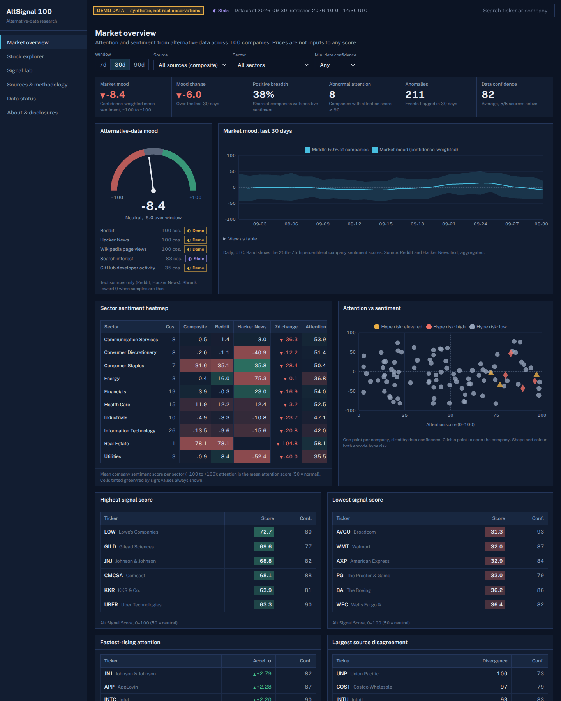
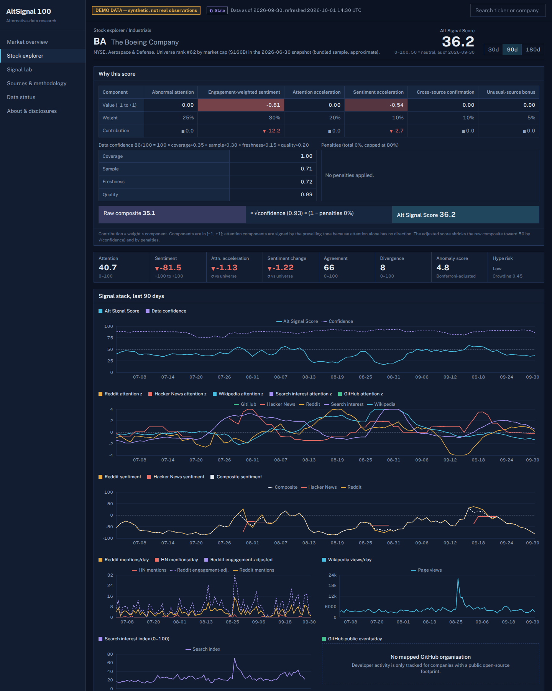
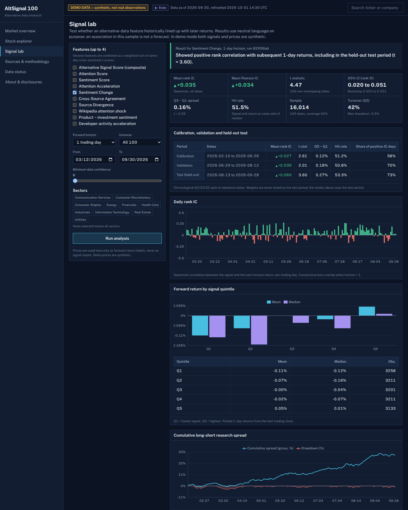

# AltSignal 100

An alternative-data research dashboard for the 100 largest US-listed companies. It measures public **attention** and **tone** from Reddit, Hacker News, Wikipedia page views, search interest and GitHub developer activity, combines them into transparent, traceable scores, and lets you test — honestly — whether those signals historically lined up with later returns.

> **Research and educational use only. Not investment advice.** Scores describe alternative-data activity; they do not predict returns. In demo mode every number is synthetic and is labelled as such on every page and export.



| Company detail | Signal Lab |
| --- | --- |
|  |  |

More: [explorer](docs/screenshots/explorer.png), [data status](docs/screenshots/data-status.png), [mobile](docs/screenshots/mobile-overview.png). To recapture, run the app and `node scripts/dev/screenshot.mjs http://localhost:3000/ out.png 1440`.

## Features

- **Market overview** — alt-data market mood gauge and time series, sector × source sentiment heatmap, attention-vs-sentiment scatter, highest/lowest scores, fastest-rising attention, largest source disagreement, score distribution, anomaly feed and a ranked table. Filters: window (7/30/90 days), source, sector, minimum confidence — all in the URL.
- **Stock explorer** — all 100 companies; search, sort, sector/source/confidence/range filters, bullish/bearish/unusual/divergent presets, column visibility, pagination, labelled CSV export, click-through.
- **Company detail** — a "Why this score" ledger (component values × weights → contributions → confidence and penalty adjustments → final score), a stacked signal panel on a shared time axis, per-source comparison, narratives by aspect, representative items with the reason each matched, anomaly timeline, score vs next-5-day return, and company-specific entity rules.
- **Signal Lab** — cross-sectional research on any 1–4 alt-data features: Pearson and Spearman IC, quintile mean/median returns, Q5−Q1 spread, hit rate, t-statistics on non-overlapping dates, normal and block-bootstrap CIs, turnover, coverage, sector/month/regime breakdowns, 60/20/20 calibration/validation/held-out test, expanding-window walk-forward, random and attention-only baselines, confidence and source-removal sensitivity, custom composite weights, mechanical look-ahead checks. Runs are stored and shareable by URL.
- **Sources & methodology**, **Data status** (source states, ingestion runs, quality events, model versions) and **About & disclosures**.

## Technology

Next.js 15 (App Router) · TypeScript (strict, `noUncheckedIndexedAccess`) · React 19 · Tailwind CSS 4 · Recharts · Zod · Drizzle ORM on SQLite/libSQL · Vitest · Playwright · GitHub Actions · Docker. Text analytics are TypeScript-only (no Python service). See [ARCHITECTURE.md](ARCHITECTURE.md) for why Drizzle/libSQL replaced the suggested Prisma/PostgreSQL.

## Architecture in one paragraph

Provider adapters (live or fixture, same normalised schema) → ingestion (clean → language → de-duplicate → entity resolution → aspect sentiment → daily aggregates) → point-in-time per-source features → cross-source composite and anomaly detection → SQLite. The web app loads an in-memory snapshot of the computed signals once per refresh, so page requests never recompute history. Prices enter only through a separate `MarketDataProvider` and are used solely for display context and forward-return labels in the Lab. Details in [ARCHITECTURE.md](ARCHITECTURE.md).

## Quick start (demo mode, no credentials)

Requires Node.js ≥ 20.11 (tested on 22).

```bash
npm install
npm run setup      # migrations + deterministic synthetic seed (~90 s)
npm run dev        # http://localhost:3000
```

One command for a production-mode demo: `npm run demo` (setup + build + start). Or with Docker: `docker compose up --build`.

### Demo mode

`ALTSIGNAL_MODE=demo` (the default) generates a deterministic synthetic world: 240 days, 100 companies, five sources with realistic gaps (simulated Reddit and Hacker News outages, a stale search feed, GitHub coverage only for companies with an open-source footprint), duplicates, cross-posts, bot-like bursts, non-English and ambiguous noise, plus eight documented scenario events (NVDA launch, BA safety story, PLTR Reddit-only hype, CRWD outage, …). Synthetic prices contain one deliberately planted, documented link to latent tone change so the Lab has something real to find — it is recovered at the 1-day horizon by *Sentiment Change*, while the default composite does **not** show stable out-of-sample performance. Set `ALTSIGNAL_PLANTED_COUPLING=0` before seeding to remove it.

### Live providers

Set `ALTSIGNAL_MODE=live` and run `npm run seed`. Implemented live adapters: Wikipedia pageviews (no key), Hacker News via Algolia (no key), GitHub org events (optional `GITHUB_TOKEN`), Reddit (OAuth app: `REDDIT_CLIENT_ID`, `REDDIT_CLIENT_SECRET`). Search interest has no live adapter (no official Google Trends API) and shows as unavailable. Prices need a licensed provider, so the Lab reports missing labels in live mode. The universe can be rebuilt from Financial Modeling Prep with `FMP_API_KEY` and `npm run universe:refresh`. **The live adapters were tested against recorded response shapes only — the build sandbox had no access to these APIs.** See [DATA_SOURCES.md](DATA_SOURCES.md).

## Environment

Copy `.env.example` to `.env.local`. Nothing is required for demo mode.

| Variable | Purpose |
| --- | --- |
| `ALTSIGNAL_MODE` | `demo` (default) or `live` |
| `DATABASE_URL` | libSQL URL, default `file:./data/altsignal.db` |
| `ALTSIGNAL_DISABLED_PROVIDERS` | comma list, e.g. `hackernews` — disables a source at runtime; scores are recomputed without it |
| `ADMIN_TOKEN` | enables `POST /api/admin/refresh` (Bearer token); unset = endpoint disabled |
| `ALTSIGNAL_CONTACT` | User-Agent with contact info for Wikimedia/Reddit |
| `REDDIT_CLIENT_ID`, `REDDIT_CLIENT_SECRET` | Reddit OAuth (optional) |
| `GITHUB_TOKEN` | higher GitHub rate limit (optional) |
| `FMP_API_KEY` | live universe refresh (optional) |
| `ALTSIGNAL_UNIVERSE_FILE` | alternative universe snapshot JSON |
| `ALTSIGNAL_AUTHOR_SALT` | salt for author hashing in live mode |
| `ALTSIGNAL_PLANTED_COUPLING` | demo price link strength (default 0.35) |

## Database

SQLite through libSQL; schema in `src/lib/db/schema.ts`, migrations in `drizzle/`.

```bash
npm run db:migrate   # apply migrations
npm run db:generate  # create a migration after editing the schema
npm run seed         # full rebuild of the selected mode
npm run refresh -- --days 7   # incremental re-ingest of the last N days, then recompute signals
```

`DATABASE_URL` also accepts a remote libSQL server (`libsql://…`, `http://…`) — untested here.

## Tests

```bash
npm run lint && npm run typecheck
npm test                 # 43 unit + 23 integration (≈2 min; integration seeds its own DB)
npm run build && npm run test:e2e   # 11 Playwright tests on two production servers
```

Playwright uses its own Chromium (`npx playwright install chromium`) unless `PW_CHROMIUM_PATH` points to a binary.

## Deployment

The app needs a writable database file or a libSQL server, and a Node runtime (it is not a static export). The `Dockerfile` builds a single image that migrates, seeds demo data on first start into the `/data` volume, and serves on port 3000. Behind a reverse proxy, set `ADMIN_TOKEN` only if you need remote refreshes, and schedule `npm run refresh` (e.g. cron) for live mode. The Dockerfile and compose file were not executed in the build environment (no Docker available).

## Documentation

[ARCHITECTURE.md](ARCHITECTURE.md) · [METHODOLOGY.md](METHODOLOGY.md) · [DATA_SOURCES.md](DATA_SOURCES.md) · [DEVELOPMENT.md](DEVELOPMENT.md) · [LIMITATIONS.md](LIMITATIONS.md) · [docs/API.md](docs/API.md) · [docs/DATA_DICTIONARY.md](docs/DATA_DICTIONARY.md)

## Known limitations

Synthetic demo data; live adapters not exercised against real APIs here; bundled universe is an approximate, hand-compiled snapshot; survivorship bias from a single snapshot; lexicon sentiment is transparent but crude; no live price provider. Full list in [LIMITATIONS.md](LIMITATIONS.md).

## Disclaimer

AltSignal 100 is a research and teaching tool. Nothing in it is a recommendation to buy, sell or hold any security. Historical associations shown in the Signal Lab may be spurious, ignore costs, and may not persist.
